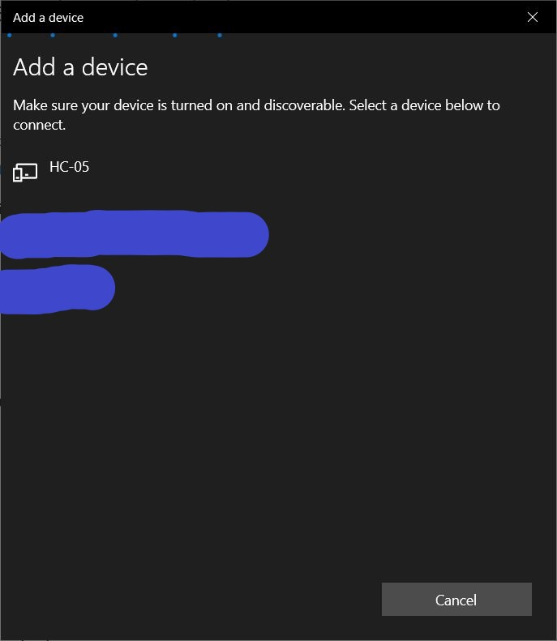
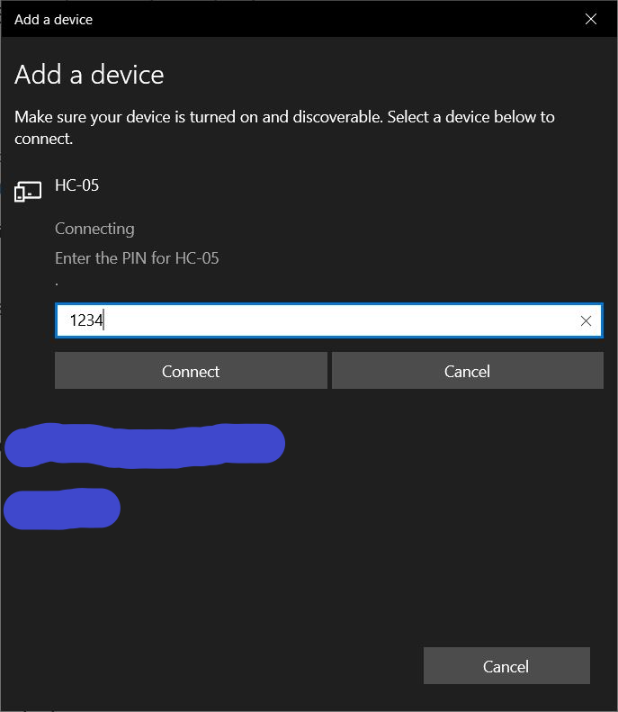
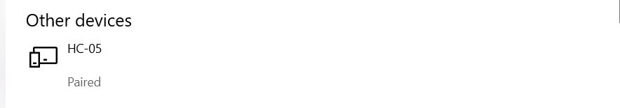
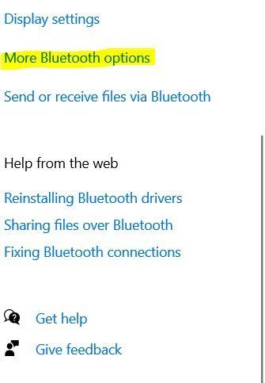
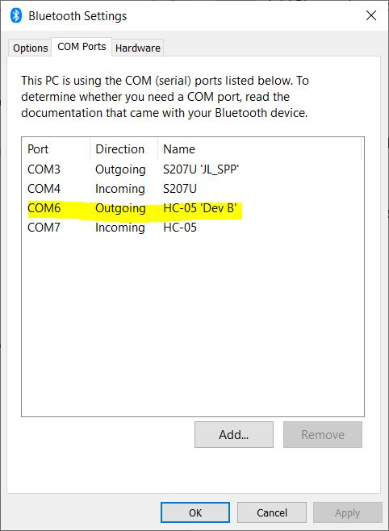
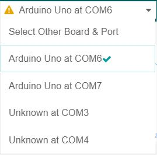
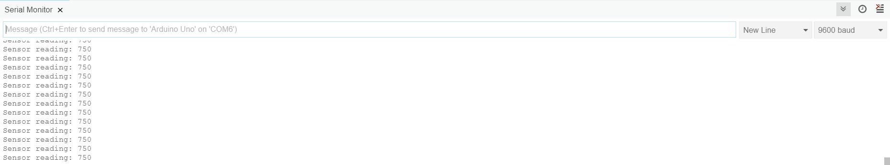

# Receive Arduino Serial Data with Bluetooth Module (HC-06)

## 🖍📐 Schematics

*  Arduino Uno   |     HC-06 
 *  ------------------------------
 *        5V      |       VCC
 *        GND     |       GND
 *        11      |       RXD
 *        10      |       TXD

## 🚀Instructions

- Step-1 

Upload the **bluetooth_read_serial.ino** to Arduino. 

- Step-2 

Disconnect the arduino port from laptop and power the arduino using external source (Like motor-driver)

- Step-3

Connect the Bluetooth Module(HC-06) to Laptop

Open Bluetooth Setting and search for Bluetooth Devices (I am using Windows 10)

Pair with Bluetooth Module with **Pin : 1234**

You can see our Bluetooth Modoule is paired with Laptop

Next we need to find the Port that we are going to use for HC-06.

Go to **More Bluetooth Options**

You will see you desired port in **COM Ports** tab

- Step 4

Our bluetooth module is connected with our Laptop and we got our desired port **COM6**

Go to Arduino Editor and Select **COM6** from ports.

Open Serial Monitor and you will start receiving data from Arduino.

Things just got a lot easier!!!!!!!!!!!

